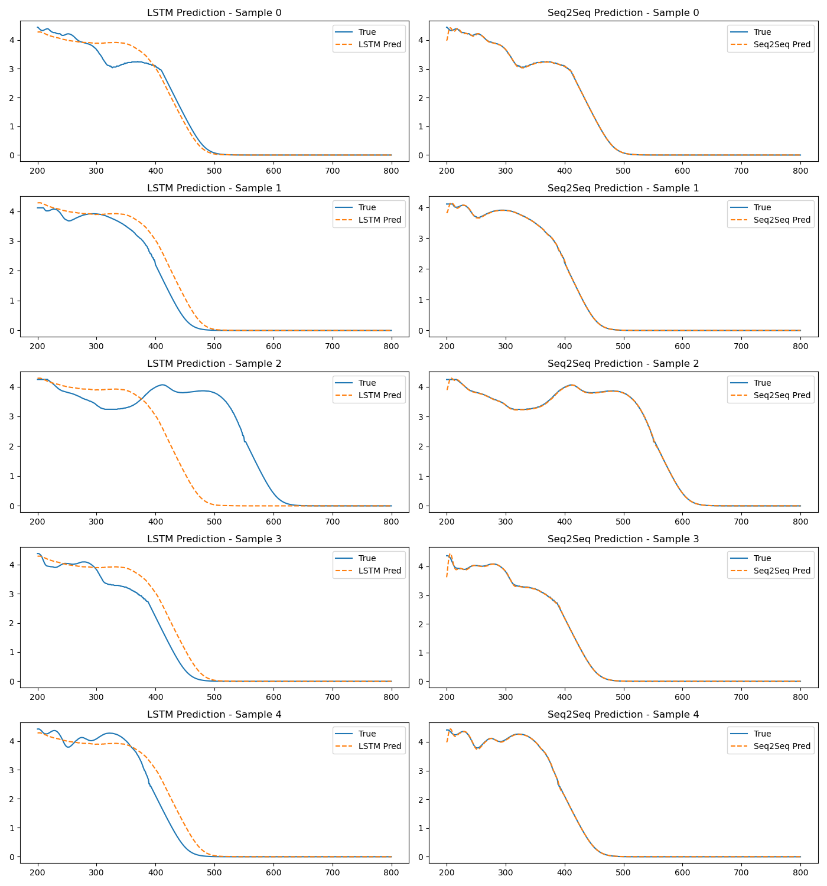

# UV-Vis-Spectrum-Prediction-from-Molecular-Structures
本项目旨在基于有机分子的结构信息（SMILES）预测其紫外-可见吸收光谱（UV-Vis Spectrum），支持科研与教学场景下对分子光谱特征的快速估算。项目构建了两个深度学习模型（LSTM 和 Seq2Seq）并提供图形化用户界面用于实时预测与可视化。
一、项目结构
'''
├── data_preprocessing.py          # 原始数据加载与处理
├── feature_engineering.py         # 分子指纹生成、SMILES 编码
├── model_training.py              # 模型训练脚本（LSTM / Seq2Seq）
├── evaluate_and_visualize.py      # 模型评估及预测结果可视化
├── uv_vis_gui_predictor.py        # 图形用户界面（GUI）预测工具
├── processed_data.pkl             # 包含特征的数据集（Pickle 格式）
├── lstm_model.keras / .h5         # 训练好的 LSTM 模型
├── seq2seq_model.keras / .h5      # 训练好的 Seq2Seq 模型
├── char_to_index.pkl              # SMILES 编码字典
├── max_smiles_length.pkl          # SMILES 最大长度
├── prediction_comparison.png      # 模型预测可视化结果图
└── README.md                      # 项目说明文档
'''
---

## 二、数据说明

- 样本总数：8379
- 每条数据包含：
  - 分子结构（SMILES）
  - 吸光度谱（200–800 nm，每 1 nm 一点，共 601 点）
  - 光谱起始与终止波长（lbound / ubound）

---

## 三、特征工程

在 `feature_engineering.py` 中完成以下步骤：

- **ECFP6指纹**：2048位，使用 Morgan 指纹（半径3）生成。
- **压缩指纹**：每256位合并为一组，共8维，便于 LSTM 输入。
- **SMILES编码**：逐字符转为整数序列，并填充至统一长度，供 Seq2Seq 编码器输入。

---

## 四、模型架构与训练

### 1. LSTM 模型（结构式指纹 → 光谱）

- 输入：8 维压缩 ECFP6 指纹，维度为 `(样本数, 8, 1)`
- 网络：多层堆叠 LSTM → Dropout → Dense
- 输出：预测 UV-Vis 光谱（601 点）

### 2. Seq2Seq 模型（字符序列 → 光谱序列）

- 编码器：SMILES 嵌入 → 3 层 LSTM
- 解码器：6 层 LSTM，使用 teacher forcing 解码出谱图
- 输出：序列形式的 UV-Vis 光谱

---

## 五、模型评估结果与分析

| 模型名称            | Mean Absolute Error (MAE) |
|---------------------|----------------------------|
| LSTM（指纹）        | 0.3926                     |
| Seq2Seq（SMILES）   | 0.0094                     |

**分析结论：**

- LSTM 模型在训练过程中收敛稳定，但由于仅使用压缩指纹，信息保留有限，导致谱图预测偏差较大。
- Seq2Seq 模型利用原始分子字符序列，学习到结构与光谱之间的映射关系，在序列生成任务中表现出色，误差远低于 LSTM，结果可视化曲线几乎重合。



---

## 六、图形用户界面（GUI）预测工具

通过 `uv_vis_gui_predictor.py` 提供一个简洁直观的图形化界面，可输入 SMILES 分子结构并查看 LSTM 与 Seq2Seq 模型预测的谱图结果。

### 使用方式：

```bash
python uv_vis_gui_predictor.py
